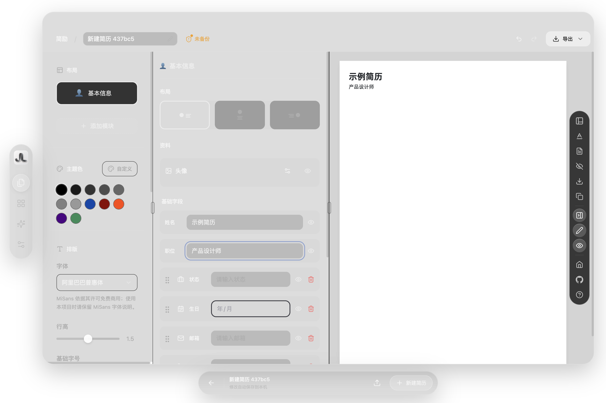
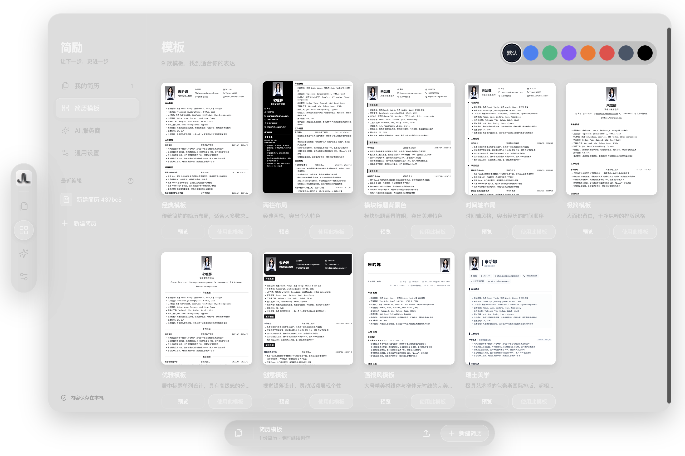

<div align="center">
  
  <h1>简励 · Jianli</h1>
  <p>让下一步，更进一步。</p>
  <p>中文 macOS 简历应用 · 原生玻璃窗口 · 本地保存 · AI 辅助编辑</p>
  <p><a href="https://github.com/17lijunyi/jianli/releases/latest">下载 Mac 版</a> · <a href="#从源码构建">从源码构建</a> · <a href="https://github.com/17lijunyi/jianli/issues">反馈问题</a> · <a href="https://17lijunyi.github.io/">作者主页</a></p>
</div>

简励是一款面向 Mac 的中文简历应用。提供简历编辑、模板选择、实时预览、PDF 导出与 AI 辅助，搭配玻璃质感窗口、悬浮控件和浅深色外观，让简历制作更直观、专注。

## 可以做什么

- **制作与管理简历**：新建、复制、搜索、模板切换、排版调整和实时预览。
- **本地保存**：内容自动保存到本机，可选择文件夹备份；支持 JSON 导入、导出和 PDF 导出。
- **AI 辅助**：支持多种 AI 服务商与自定义模型配置，辅助优化简历内容；需自行配置 API，费用由服务商决定。
- **真实窗后玻璃**：使用 macOS `NSVisualEffectView` 取窗后材质，悬浮控件之外保留透明间隙，不使用壁纸截图冒充桌面。
- **稳定的铺满与还原**：绿色按钮、窗口菜单和 `Control-Command-F` 共用还原尺寸记录；连续切换后可恢复原位置与大小。
- **纸张保持独立**：界面玻璃化，简历仍按白色 A4 纸张排版；预览缩放不改变导出尺寸。

## 界面预览



<details>
<summary>查看模板库</summary>



</details>

截图使用独立测试资料，只展示界面。窗口外透明区域在截图中可能显示为黑色；实际窗后透光由 macOS 合成，效果随桌面、系统外观和“减少透明度”设置变化。

## 下载与使用

在 [Releases](https://github.com/17lijunyi/jianli/releases) 下载 Apple Silicon 版本，解压后将「简励.app」放入“应用程序”。应用自带运行环境，不需要另开终端或网页服务。

当前提供 **Apple Silicon / arm64、macOS 13 及以上** 构建，已在 macOS 26.5.2 验证；未提供 Intel、Windows 或 Linux 桌面包。安装包使用本地临时签名，尚未经过 Apple Developer ID 公证，macOS 可能限制打开；也可以按下面的步骤在本机构建。

绿色按钮在当前桌面可用区域铺满窗口，再次点击还原，保留菜单栏与程序坞，不进入独立全屏空间。`Command-Q` 退出；关闭窗口后点击程序坞图标可重新打开。

## 数据与 AI 请求

简历和设置保存在 `~/Library/Application Support/Magic Resume Desktop`。为兼容已有安装，这个目录名、bundle ID `local.magicresume.desktop` 和本地地址 `http://127.0.0.1:43871` 保持不变；请勿随意修改，否则可能读到不同的浏览器存储。

桌面服务仅监听 `127.0.0.1`。网页浏览器与桌面应用的简历存储相互独立，可用 JSON 迁移。AI 功能需要网络，并会将相关内容发送给你配置的模型服务商；启用前请确认服务商与要发送的内容。仓库和发布包不包含任何个人简历、API Key 或本机备份。

## 从源码构建

需要 Apple Silicon Mac、Xcode Command Line Tools、Node.js 24 和 pnpm 11.19.0。

```bash
git clone https://github.com/17lijunyi/jianli.git
cd jianli/magic-resume
pnpm install --frozen-lockfile
pnpm build

cd ../magic-resume-desktop
npm ci
node build-native.cjs
node build-runtime.cjs
npm run package
codesign --force --deep --sign - "release/简励-darwin-arm64/简励.app"
```

产物：`magic-resume-desktop/release/简励-darwin-arm64/简励.app`。

原生组件需要 Node.js C 头文件，默认从 Node 安装目录的 `include/node` 查找；如提示缺失，可下载对应版本的官方头文件后指定 `NODE_INCLUDE_DIR`：

```bash
# 在 magic-resume-desktop 目录执行
NODE_VERSION="$(node -p process.versions.node)"
mkdir -p .cache/node-headers
curl --fail --location "https://nodejs.org/dist/v${NODE_VERSION}/node-v${NODE_VERSION}-headers.tar.gz"   --output .cache/node-headers/headers.tar.gz
tar -xzf .cache/node-headers/headers.tar.gz -C .cache/node-headers
NODE_INCLUDE_DIR="$PWD/.cache/node-headers/node-v${NODE_VERSION}/include/node" node build-native.cjs
```

仅预览网页界面可在 `magic-resume` 执行 `pnpm dev`。真实桌面玻璃与原生窗口控制仅在 Mac 桌面壳中生效。

## 开发与验证

| 目录 | 内容 |
| --- | --- |
| `magic-resume/` | 简历业务、模板、编辑器及玻璃界面 |
| `magic-resume-desktop/` | Electron 主进程、本地服务、构建脚本 |
| `magic-resume-desktop/native/` | AppKit 玻璃层和窗口还原逻辑 |
| `magic-resume-desktop/tests/` | 使用独立临时数据的桌面回归 |
| `docs/screenshots/` | 仅含示例数据的展示截图 |

```bash
# 在完成构建后的 magic-resume-desktop 目录执行
mkdir -p artifacts
node tests/desktop-fill.cjs --packaged
node tests/smoke.cjs
node tests/glass-preview.cjs
```

窗口回归覆盖 24 次铺满/还原、24 次快速切换、6 次页面缩放、原生面板对齐与透明度，以及编辑、保存和重新加载。其他检查覆盖模板、JSON/PDF 导出、浅深外观及 A4 预览。CI 检查前端生产构建，原生桌面测试需在 Mac 图形会话中运行。

## 来源与许可

> **使用条件：** 保留上游的 Apache 2.0 许可及非商业使用附加条款，个人非商业用途免费。源码公开不等于可自由商用；商业使用须依上游条款取得授权。完整原文见 [LICENSE](LICENSE)。这是独立维护的衍生项目，并非上游官方 Mac 客户端。

感谢 [JOYCEQL / Magic Resume](https://github.com/JOYCEQL/magic-resume) 及其贡献者提供简历编辑器。此版本基于提交 `e369fbed4aa38e43257cf33817a521c6a5a559cd`，增加了桌面封装、AppKit 材质、简励品牌和相关界面调整。修改范围见 [MODIFICATIONS.md](MODIFICATIONS.md)，署名见 [NOTICE](NOTICE)。依赖和上游资源保留各自的许可与声明，字体说明见 [字体许可](magic-resume/public/fonts/licenses/README.md)。

[完整许可与商业限制](LICENSE) · [问题反馈](https://github.com/17lijunyi/jianli/issues) · [李俊祎的个人主页](https://github.com/17lijunyi)
